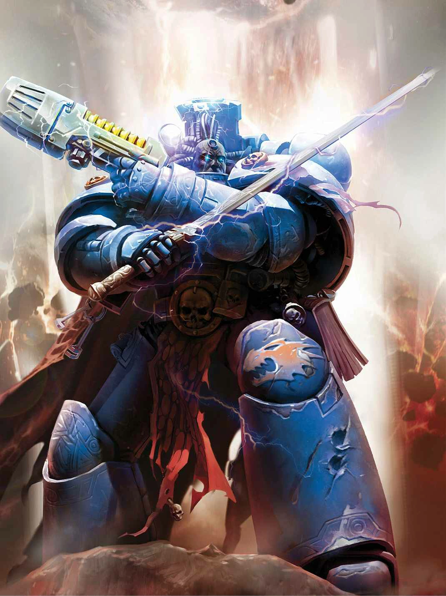

#### SpaceMarine Librarian {#librarian .newpage}

{height=5cm}

Les Librarians font office de gardiens du savoir et de psykers au sein de leurs Chapitres. Bon nombre d’entre eux se spécialisent dans l’élimination et le bannissement des démons ou des hérétiques.

#### SpaceMarine Librarian

*SpaceMarine (toute origine) de taille moyenne, loyal bon*

**Classe d'armure** 18 (armure énergétique)

**Points de vie** 82 (11d8 + 33)

**Vitesse** 9 m

|FOR    | DEX    | CON    | INT    | SAG    | CHA|
|:---:  | :---:  | :---:  | :---:  | :---:  | :---:|
|16 (+3)| 14 (+2)| 16 (+3)| 14 (+2)| 18 (+4)| 15 (+2)|

**Jet de sauvegarde** : Con +6, Sag +3, Cha +5

**Compétences** : Connaissances +8, Occultisme +7

**Résistance aux dégats** : Poison, Psychique

**Sens** : Vision dans le noir 18 mètres, Perception passive 16

**Langues** : parle le bas-gothique, les codes impériaux, le haut-gothique et deux langues supplémentaires

**Facteur de puissance** : 6 (2 300 XP)

##### Traits

**Courage.** Le Space Marine bénéficie d’un avantage aux jets de sauvegarde contre l’effroi.

**Biologie surhumaine.** Le Space Marine bénéficie d’un avantage aux jets de sauvegarde contre le poison et les maladies non améliorées.

**Lanceur de pouvoir psychiques.** Le Librarian est un lanceur de pouvoir psychiques de niveau 10. Sa capacité de lancement de sorts psychiques est la Sagesse (jet de sauvegarde contre les sorts : 15, +7 pour toucher). Le Librarian dispose de 40 points de pouvoir psychique et connaît les pouvoirs psychiques suivants :

*À volonté* : Châtiment (2d10), Invoquer des phénomènes, Main psychique

*Niveau 1* : Détection du warp, Ordre, Repousser le warp

*Niveau 2* : Brûlot de Malcador, Détecter l’invisibilité, Entrave de personne

*Niveau 3* : Appel de la foudre, Perturbation du warp, Repousser la sorcière

*Niveau 4* : Bannissement, Nécrose, Relocalisation

*Niveau 5* : Entrave de monstre, Immolation, Restauration supérieure

##### Actions

**Attaque multiple.** Le Space Marine attaque deux fois.

**Épée longue de Force.** Attaque au corps à corps : +7 pour toucher, portée de 1,5 mètre, une cible. En cas de coup réussi : 13 (2d8+4) points de dégâts cinétiques si elle est maniée d'une seule main, ou 15 (2d10+4) points de dégâts cinétiques si elle est maniée à deux mains.

