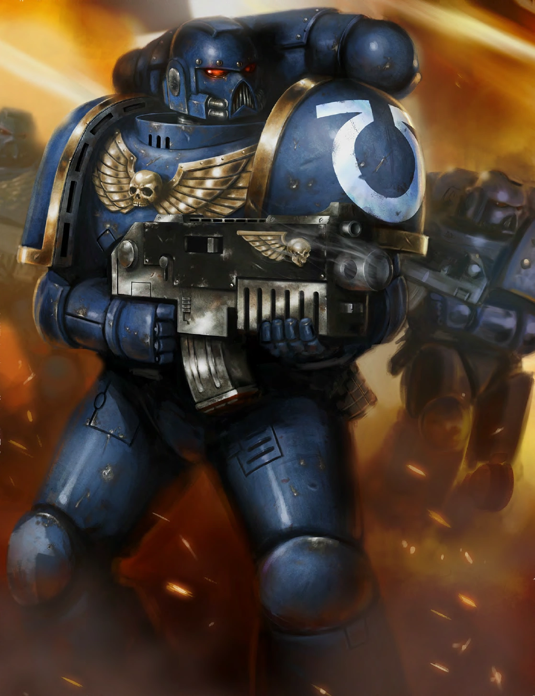

#### SpaceMarine Tactique {#tactical .newpage}

{height=5cm}

Les Marines tactiques servent de combattants de première ligne dans tous les chapitres. Ils sont suffisamment polyvalents pour mener l'offensive à l'aide d'armes de corps à corps ou pour tenir une ligne défensive grâce à des tirs de bolter de couverture.

#### SpaceMarine Tactique

*SpaceMarine (toute origine) de taille moyenne, loyal bon*

**Classe d'armure** 18 (armure énergétique)

**Points de vie** 82 (11d8 + 33)

**Vitesse** 9 m

|FOR    | DEX    | CON    | INT    | SAG    | CHA|
|:---:  | :---:  | :---:  | :---:  | :---:  | :---:|
|18 (+4)| 16 (+3)| 17 (+3)| 14 (+2)| 10 (0)| 12 (+1)|

**Jet de sauvegarde** : For +7, Con +6 Sag +3

**Compétences** : Athlétisme +7, Perception +6

**Résistance aux dégats** : Poison

**Sens** : Vision dans le noir 18 mètres, Perception passive 16

**Langues** : parle le bas-gothique, les codes impériaux et le haut-gothique

**Facteur de puissance** : 5 (1 800 XP)

##### Traits

**Courage.** Le Space Marine bénéficie d’un avantage aux jets de sauvegarde contre l’effroi.

**Armes améliorées.** Les attaques à l’arme du Space Marine sont améliorées.

**Biologie surhumaine.** Le Space Marine bénéficie d’un avantage aux jets de sauvegarde contre le poison et les maladies non améliorées.

**Spécialiste des armes.** Les armes infligent un dé de dégâts supplémentaire lorsque le Marine de la Deathwatch touche avec celle-ci (inclus dans l’attaque).

##### Actions

**Attaque multiple.** Le Marine tactique attaque deux fois.

**Carabine.** Attaque à distance : +6 pour toucher, portée 24/100 mètres, une cible. Touché : 12 (2d8+3) points de dégâts cinétiques.

**Épée longue.** Attaque avec une arme de mêlée : +7 pour toucher, portée de 1,5 mètre, une cible. Touché : 13 (2d8+4) points de dégâts cinétiques si utilisé à une main ou 15 (2d10+4) points de dégâts cinétiques si utilisé à deux mains.

