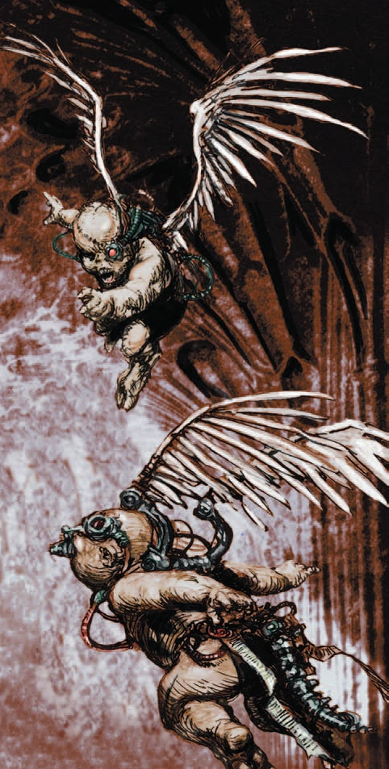

#### Chérubin  {#Cherubin  .newpage}

{height=5cm}

Les chérubins sont de minuscules bébés ressemblant à des anges, créés par cybernétique par le Culte du Mechanicum. Ces petites créatures sont utilisées par les Sœurs de Bataille, les chapitres de Space Marines et les Inquisiteurs. Elles peuvent être employées pour effectuer des tâches simples, telles que le nettoyage et l'entretien des armes.

#### Chérubin

*Construct de très petite taille, tout alignement loyal*

**Classe d'armure** 10 (armure naturel)

**Points de vie** 2 (1d4)

**Vitesse** 4,5m , vol 9m

|FOR    | DEX    | CON    | INT    | SAG    | CHA|
|:---:  | :---:  | :---:  | :---:  | :---:  | :---:|
|3 (-4)| 11 (0)| 10 (0)| 12 (+1)| 10 (0)| 7 (-2)|

**Sens** : Perception passive 10

**Résistance aux dégats** : poison

**Langues** : comprend le binaire et le bas-gothique mais ne les parles pas

**Facteur de puissance** : 0 (10 XP)

##### Traits

**Lanceur de pouvoir technologique.** Le chérubin est un lanceur de pouvoir technologique de niveau 1 (jet de sauvegarde technologique de 11, +3 pour toucher avec les attaques techniques). Il dispose de 4 points de lanceur de pouvoir technologique et maîtrise les pouvoirs technologique suivants :

*À volonté* : Réparation mineur

*Niveau 1* : Copie, Réparation

**Outils intégrés.** Le chérubin est équipé de deux jeux d’outils, qu’il maîtrise (généralement une trousse de mécanicien et du matériel de peintre).

##### Actions

**Coup violent.** Attaque à l’arme de mêlée : +2 pour toucher, portée de 1,5 mètres, une cible. Touché : 1 point de dégâts cinétiques.

