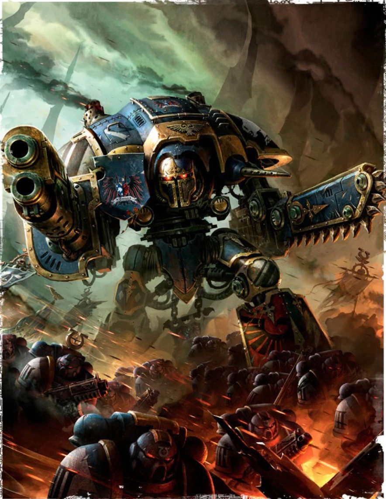

#### Chevalier Impérial  {#Chevalier  .newpage}

{height=5cm}

Les Chevaliers Impériaux sont de redoutables marcheurs de combat pilotés par des nobles des Grandes Maisons, héritiers de traditions guerrières aussi anciennes que l’Imperium lui-même. Plus rapides et plus agiles que les Titans, ces machines imposantes combinent une puissance de feu dévastatrice et un arsenal de corps à corps terrifiant, servant aussi bien de gardiens de leurs domaines que de champions sur les champs de bataille.

#### Chevalier Impérial

*Construct Gigantesque, tout alignement loyal*

**Classe d'armure** 22 (armure naturel)

**Points de vie** 434 (28d12 + 252)

**Vitesse** 18 m

|FOR    | DEX    | CON    | INT    | SAG    | CHA|
|:---:  | :---:  | :---:  | :---:  | :---:  | :---:|
|29 (+3)| 10 (0)| 28 (+9)| 18 (+4)| 17 (+3)| 21 (+5)|

**Jet de sauvegarde** : Dex +7, Con +16, Sag +10, Cha +12

**Compétences** : Athlétisme +16, Perception +17

**Sens** : Vision aveugle 18 mètres, Vision dans le noir 36 m,  Perception passive 27

**Résistance aux dégats** : foudre, nécrotique

**Immunisé aux dégâts** : au poison, aux dégâts pyschiques, à la foudre ; aux dégâts d’énergie et cinétiques infligés par des attaques non améliorées et non bénies.

**Immunisé aux états** : Charmé, fatigué, effrayé, paralysé, pétrifié, empoisonné, immobilisé

**Langues** : parle le bas-gothique, le binaire et le haut-gothique

**Facteur de puissance** : 22 (41 000 XP)

##### Traits

**Machinerie divine.** Le chevalier bénéficie d’un avantage lors des jets de sauvegarde contre les pouvoirs technologiques.

**Discipline du combat rapproché.** Le chevalier ne subit pas de désavantage lors de ses jets d’attaque à distance tant qu’une créature se trouve à moins de 1,5 mètre de lui.

**Armes améliorées.** Les attaques à l’arme du chevalier sont améliorées.

**Résistance légendaire (3/jour).** Si le chevalier échoue à un jet de sauvegarde, il peut choisir de le réussir à la place.

##### Actions

**Attaque multiple.** Le Chevalier impérial effectue trois attaques avec son épée de chevalier. Il peut également effectuer deux attaques avec son canon à plasma.

**Canon à plasma.** Attaque à distance : +16 pour toucher, portée 30/120 mètres, une cible. Touché : 22 (3d10+9) points de dégâts d’acide.

**Épée de chevalier.** Attaque à l’arme de mêlée : +16 pour toucher, portée de 4,5 mètres, une cible. Touché : 20 (2d10+9) points de dégâts cinétiques.

**Surcharge de plasma(recharge 5-6).** Le chevalier tire du plasma en formant une ligne de 36 mètres de long et 3 mètres de large. Chaque créature se trouvant sur cette ligne doit effectuer un jet de sauvegarde de Dextérité avec un DD de 23 ; en cas d’échec, elle subit 88 (16d10) points de dégâts d’acide, ou la moitié de cette valeur en cas de réussite.

##### Actions légendaires

Le chevalier impérial peut effectuer 3 actions légendaires, en choisissant parmi les options ci-dessous. Une seule option d’action légendaire peut être utilisée à la fois, et uniquement à la fin du tour d’une autre créature. Le dreadnought récupère ses actions légendaires dépensées au début de son tour.

**Détection.** Le chevalier effectue un jet de Perception.

**Épée de chevalier.** Le chevalier effectue une attaque avec son épée de chevalier.

**Canon à plasma.** Le chevalier effectue une attaque avec son canon à plasma.

**Piétinement (coûte 2 actions).** Le chevalier charge sur 9 mètres en ligne droite sur une largeur de 4,5 mètres ; sa charge s’arrête prématurément lorsqu’il entre en collision avec une créature ou un objet de taille Énorme ou supérieure. Chaque créature se trouvant dans la zone d’effet doit réussir un jet de sauvegarde de Force avec un DD de 23, sinon elle subit 25 (3d10+9) points de dégâts cinétiques et est renversée.

