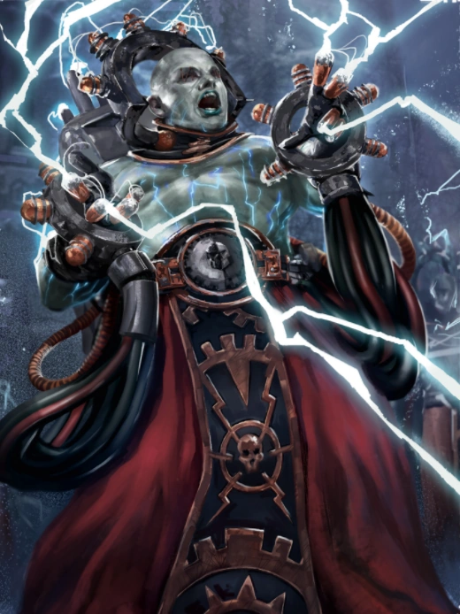

#### Électro-prêtre  {#Electropretre  .newpage}

{height=5cm}

Qu'il s'agisse d'utiliser l'électricité pour recharger des batteries ou pour anéantir les ennemis de l'Imperium, les électro-prêtres recourent à des greffes cybernétiques pour canaliser l'énergie à travers leurs paumes recouvertes de cuivre. Incarnant souvent l'énergie même qu'ils contrôlent, les électro-prêtres se laissent emporter par une frénésie religieuse au cœur des combats et comptent parmi les plus fervents fidèles de l'Omnissiah.

> 01010000 01110010 01100001 01101001 01110011 01100101 00100000 01100010 01100101 00100000 01110100 0 1101111 00100000 01110100 01101000 01100101 00100000 01001111 01101101 01101110 01101001 01110011 01 110011 01101001 01100001 01101000 00101110 00100000

*-Passene Qvyrrc ; Trifacteur adaptatif du modèle archéotechnique*

#### Électro-prêtre

*Humanoïde (Techno-fusionné) de taille moyenne, loyal neutre*

**Classe d'armure** 15 (armure de troupe)

**Points de vie** 41 (8d8 + 5)

**Vitesse** 9 m, vol 3 m (stationnaire)

|FOR    | DEX    | CON    | INT    | SAG    | CHA|
|:---:  | :---:  | :---:  | :---:  | :---:  | :---:|
|14 (+2)| 12 (+1)| 12 (+1)| 16 (+3)| 13 (+1)| 11 (0)|

**Jet de sauvegarde** : Con +3

**Compétences** : Technologie +5

**Sens** : Perception passive 10

**Résistance aux dégats** : foudre

**Langues** : parle le bas-gothique et le binaire

**Facteur de puissance** : 4 (1 100 XP)

##### Traits

**Résilience artificielle.** Le prêtre bénéficie d’un avantage aux jets de sauvegarde contre l’empoisonnement et est immunisé contre les maladies non améliorier. Le prêtre ne peut pas être endormi.

**Mécadendrite.** Le prêtre dispose d’une mécadendrite qui fonctionne exactement comme un bras supplémentaire. Il bénéficie d’un avantage aux jets de sauvegarde de Force contre les effets qu’il peut voir, ainsi qu’aux tests de Force (Athlétisme) pour résister à une prise.

**Lanceur de pouvoir technologique.** Le prêtre est un lanceur de pouvoir technologique de niveau 5 (jet de sauvegarde technologique de 13, +5 pour toucher avec les attaques techniques). Il dispose de 20 points de lanceur de pouvoir technologique et maîtrise les pouvoirs technologique suivants :

À volonté : décharge de plasma, marche/arrêt, réparation
Niveau 1 : décharge électrique, étincelle de photons, surcharge
Niveau 2 : arcs électrique, métal brûlant
Niveau 3 : affaiblissement technologique, surtension foudroyante

##### Actions

**Attaques multiples** Le prêtre utilise deux fois « Rayon électrique ».

**Fouet.** Attaque au corps à corps : +5 pour toucher, portée de 3 mètres, une cible. Touché : 6 (1d4+2) points de dégâts cinétiques.

**Rayon électrique.** Attaque à distance : +5 pour toucher, portée de 9 mètres, une cible. Touché : 10 (3d6) points de dégâts de foudre.

