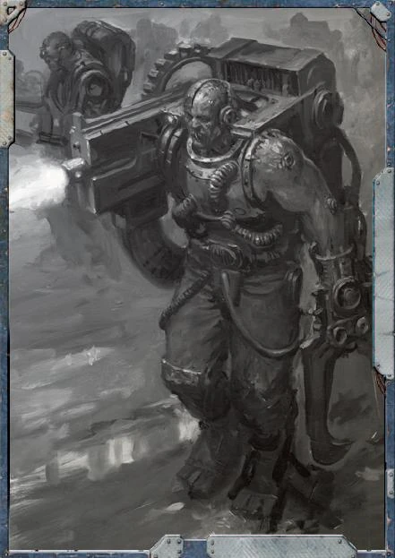

#### Servitor de combat  {#ServitorCombat  .newpage}

{height=5cm}

Les serviteurs de combat étaient autrefois des humains qui ont subi une lobotomie et ont été transformés, à toutes fins pratiques, en machines, perdant ainsi leur autonomie et leur libre arbitre. On leur implante ensuite des armes et ils servent d'infanterie de première ligne lors de batailles à grande échelle.

#### Servitor de combat

*Construct de taille moyenne, sans alignement*

**Classe d'armure** 13 (armure naturel)

**Points de vie** 13 (2d8 + 4)

**Vitesse** 9 m

|FOR    | DEX    | CON    | INT    | SAG    | CHA|
|:---:  | :---:  | :---:  | :---:  | :---:  | :---:|
|15 (+2)| 14 (+2)| 14 (+2)| 5 (-3)| 8 (-1)| 8 (-1)|

**Sens** : Perception passive 9

**Résistance aux dégats** : poison

**Langues** : comprend le binaire mais ne le parle pas

**Facteur de puissance** : 1/4 (50 XP)

##### Traits

**Résilience du serviteur.** Le serviteur bénéficie d’un avantage aux jets de sauvegarde contre l’empoisonnement. Les pouvoirs ne peut pas l’endormir. Les armes du serviteur ne peuvent pas être déséquipés.

##### Actions

**Masse.** Attaque au corps à corps avec une arme : +4 pour toucher, portée de 1,5 mètre, une cible. Touché : 5 (1d6+2) points de dégâts cinétiques.

**Pistolet laser.** Attaque à distance : +4 pour toucher, portée 12/48 mètres, une cible. Touché : 5 (1d6+2) points de dégâts d'énergie.

