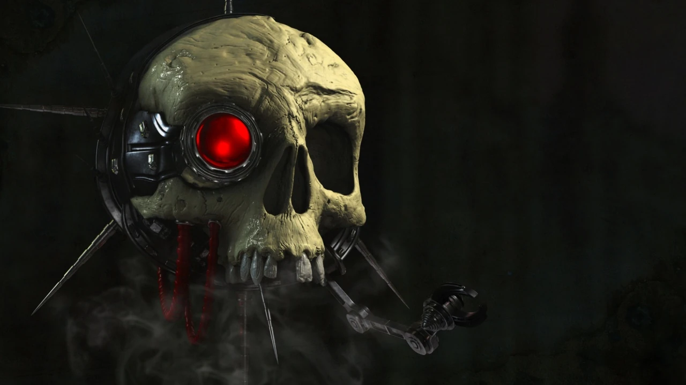

#### Servo-crane  {#ServoCrane  .newpage}

{height=5cm}

Les servo-crânes sont un type de serviteur constitué d'un crâne dans lequel subsistent des traces de la conscience de son ancien occupant, maintenu en suspension par un petit dispositif. Les servo-crânes sont capables d'effectuer des tâches élémentaires, telles que l'enregistrement d'informations et la transmission de messages.

#### Servo-crane

*Construct de très petite taille, non aligné*

**Classe d'armure** 8 (armure naturel)

**Points de vie** 1 (1d4-1)

**Vitesse** 1,5m , vol 18m (stationnaire)

|FOR    | DEX    | CON    | INT    | SAG    | CHA|
|:---:  | :---:  | :---:  | :---:  | :---:  | :---:|
|3 (-4)| 7 (-2)| 8 (-1)| 3 (-4)| 10 (0)| 3 (-4)|

**Compétences** : Perception +2

**Sens** : Perception passive 12

**Résistance aux dégats** : poison

**Résistance aux états** : empoisonné

**Langues** : comprend le binaire et le bas-gothique mais ne les parles pas

**Facteur de puissance** : 0 (10 XP)

##### Traits

**Vision partagée.** Une créature équipée d’une tablette de données ou d’un appareil d’enregistrement similaire peut se connecter à un servo-crâne après 1 minute, à condition de le toucher. Tant qu’un appareil est connecté au servo-crâne et se trouve à moins de 30 mètres de celui-ci, la créature peut utiliser une action pour voir à travers les yeux du servo-crâne sur l’appareil d’enregistrement. Ce faisant, la créature peut parler à travers le servo-crâne en utilisant sa propre voix.

##### Actions

**Coup violent.** Attaque à l'arme de mêlée : +0 pour toucher, portée de 1,5 mètres, une cible. Touché : 1 point de dégâts cinétiques.

