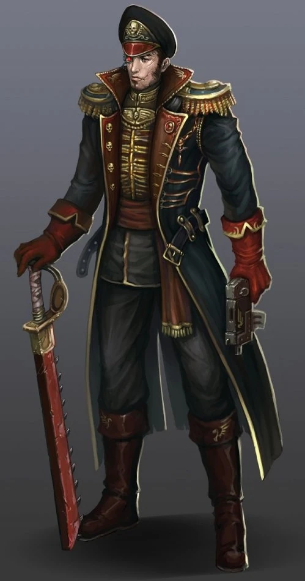

#### Commissaire {#commissaire .newpage}

{height=5cm}

Au sein de la Garde Impériale, ce sont les commissaires qui portent le fardeau le plus lourd de tous : le moral des troupes. Dans l’Imperium de l’Humanité, la vie est valorisée dans son ensemble, et non au niveau individuel, et les commissaires sont formés pour exécuter des hommes au cœur de la bataille afin de rappeler à leurs troupes qu’il vaut mieux mourir pour l’Empereur que pour soi-même.

**Équipement alternatif**

Les commissaires sont très appréciés au sein de l’Imperium. Il est possible qu’ils portent des grenades à fragmentation ou qu’ils disposent d’équipements améliorés tels que des armes à bolts, des armes à plasma ou des armes énergétiques. Gardez à l’esprit que doter un commissaire de ces armes augmentera ses dégâts infligés, et potentiellement son indice de défi.

#### Commissaire

*Humain (toute planète d'origine) de taille moyenne, tout alignement bon*

**Classe d'armure** 17 (armure d'assaut)

**Points de vie** 59 (9d8 + 18)

**Vitesse** 9 m

|FOR    | DEX    | CON    | INT    | SAG    | CHA|
|:---:  | :---:  | :---:  | :---:  | :---:  | :---:|
|16 (+3)| 16 (+3)| 14 (+2)| 14 (+2)| 14 (+2)| 16 (+3)|

**Jet de sauvegarde** : For +4, Dex +5, Sag +4

**Compétences** : Intimidation +7, Perception +4, Persuasion +5

**Sens** : Perception passive 12

**Langues** : parle le bas-gothique, les codes impériaux, le haut-gothique

**Facteur de puissance** : 3 (700 XP)

##### Traits

**Présence inspirante.** Le commissaire et les créatures alliées situées à moins de 9 mètres de lui bénéficient d’un avantage aux jets de sauvegarde contre l’effet « effrayé ».

**Discipline du combat rapproché.** Le commissaire ne subit pas de désavantage aux jets d’attaque à distance si une créature hostile se trouve à moins de 5 pieds de lui.

##### Actions

**Attaque multiple.** Le commissaire effectue trois attaques avec son gantelet, ou deux attaques avec son pistolet laser.

**Pistolet laser.** Attaque à distance : +5 pour toucher, portée 12/48 pieds, une cible. Touché : 7 (1d8+3) points de dégâts d'énergie.

**Gantelet.** Attaque avec une arme de mêlée : +5 pour toucher, portée de 1,5 mètre, une cible. Touché : 7 (1d8+3) points de dégâts cinétiques.

##### Réactions

**Exécuter.** Le commissaire attaque une créature alliée située à moins de 9 mètres, infligeant un coup critique à la cible. Si la cible meurt, toutes les créatures alliées situées à moins de 18 mètres et pouvant voir le commissaire voient les états « effrayé » et « charmé » qui les affectent disparaître.

