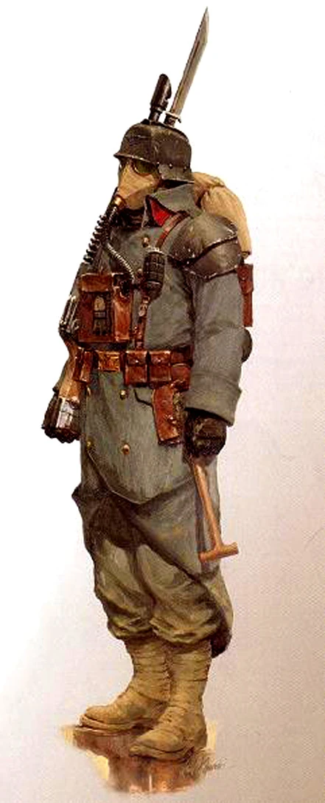

#### Soldat de Krieg {#krieg .newpage}

{height=5cm}

Le soldat de la Death Korps de Krieg est un fantassin de l'Astra Militarum élevé dès son plus jeune âge dans une culture de discipline absolue, de pénitence et de sacrifice. Protégé par son emblématique masque à gaz et son uniforme lourd, il avance implacablement sous les tirs ennemis, sans peur apparente et sans considération pour sa propre survie. Les régiments de Krieg excellent dans la guerre de tranchées, les sièges et les assauts d'attrition, où leur endurance et leur mépris de la mort font d'eux des adversaires terrifiants.

Pour un Krieg, mourir au service de l'Empereur n'est pas une tragédie : c'est l'accomplissement de son devoir.

#### Soldat du Krieg

*Humain (monde mort) de taille moyenne, loyal neutre*

**Classe d'armure** 15 (armure pare-éclats)

**Points de vie** 20 (3d8 + 6)

**Vitesse** 9 m

|FOR    | DEX    | CON    | INT    | SAG    | CHA|
|:---:  | :---:  | :---:  | :---:  | :---:  | :---:|
|15 (+2)| 14 (+2)| 14 (+2)| 10 (0)| 12 (+1)| 9 (-1)|

**Compétence** : Perception +3

**Sens** : Perception passive 13

**Langues** : parle le bas-gothique et les codes impériaux

**Facteur de puissance** : 1/2 (100 XP)

##### Traits

**Dévouement.** Le soldat de Krieg bénéficie d’un avantage aux jets de sauvegarde contre l’état « effrayé ». Si un commissaire se trouve à moins de 9 mètres du soldat de Krief, ce dernier est immunisé contre l’état « effrayé ».

##### Actions

**Pelle de combat.** Attaque au corps à corps : +4 pour toucher, portée 1,5 mètres, coup réussi : 6 (1d8+2) points de dégâts cinétiques.

**Carabine Laser.** Attaque à distance : +4 pour toucher, portée de 25/100 mètres, une cible. Touché : 6 (1d8+2) points de dégâts énergétiques.

