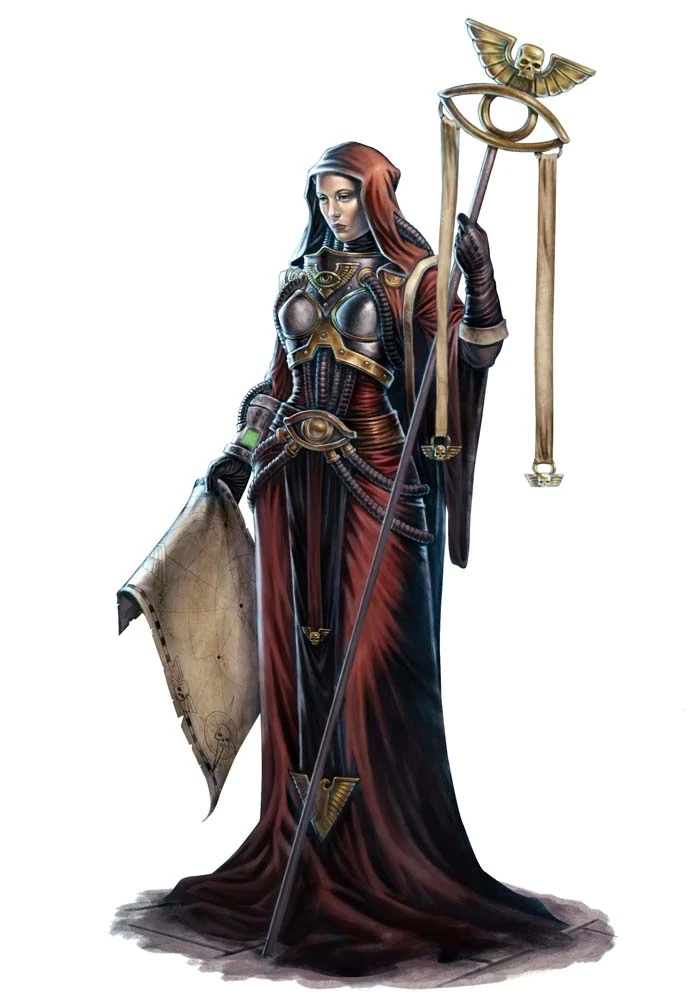

#### Astropathe {#astropathe}

{height=5cm}

#### Astropathe

*Humain (toute planète d'origine) de taille moyenne, loyal bon*

**Classe d'armure** 10 (armure naturelle)

**Points de vie** 13 (3d8)

**Vitesse** 9 m

|FOR    | DEX    | CON    | INT    | SAG    | CHA|
|:---:  | :---:  | :---:  | :---:  | :---:  | :---:|
|10 (0)| 10 (0)| 10 (0)| 11 (+1)| 13 (+1)| 12 (+1)|

**Jet de sauvegarde** : Sag +3, Cha +3

**Compétences** : Occultisme +3

**Resistance aux dégâts** : psychique

**Sens** : Perception passive 12

**Langues** : parle le bas-gothique)

**Facteur de puissance** : 1/2 (100 XP)

##### Traits

**Perturbation psychique.** Les créatures hostiles situées à moins de 3 mètre du « blank » qui lancent un pouvoir psychique doivent effectuer un jet de sauvegarde de Constitution avec une difficulté de 12. En cas d’échec, le pouvoir ne peut être lancé et les points de pouvoir psychique utilisés pour le lancer sont perdus.

**Anathème psychique.** Le « blank » bénéficie d’un avantage lors des jets de sauvegarde contre les pouvoirs psychiques.

**Sans âme.** Le personnage est à l’abri des effets psychiques qui permettraient de déterminer sa position, son humeur ou ses pensées, tels que « zone divine » et « détection des pensées ».

##### Actions

**Attaque multiple.** Le personnage effectue deux attaques.

**Épée courte.** Attaque avec une arme de mêlée : +4 pour toucher, portée de 1,5 mètre, une cible. En cas de coup réussi : 5 (1d6+2) points de dégâts cinétiques.

**Pistolet.** Attaque avec une arme à distance : +4 pour toucher, portée de 12/48 mètres, une cible. En cas de coup réussi : 5 (1d6+2) points de dégâts cinétiques.

