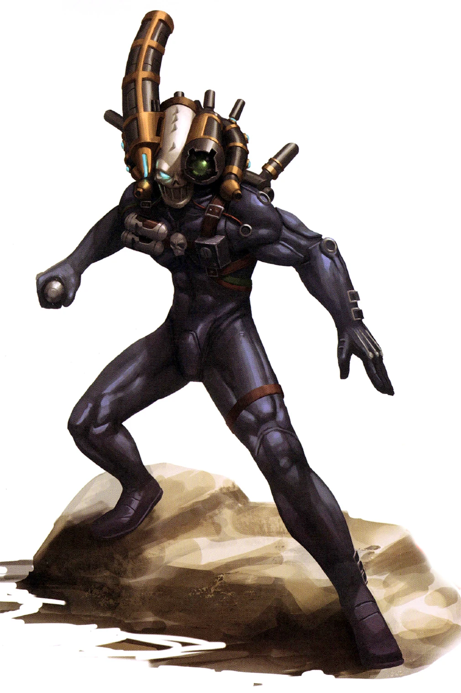

#### Assassin Culexus {#Culexus  .newpage}

{height=5cm}

Parias même parmi les assassins, les assassins culexus sont des « blanks » : des humains nés sans âme. Ils sont formés et modifiés cybernétiquement pour renforcer leurs capacités anti-psykers naturelles, et équipés de leurs objets les plus singuliers et reconnaissables : leur combinaison « synskin » intégrant de l’Étherium, et leur Animus Speculum.
Étherium. Cet implant permet à l’assassin culexus de traverser temporairement les murs, les surfaces et autres éléments matériels.

**Animus Speculum.** Fixé au casque en forme de crâne de l’assassin, cet appareil, une fois dévoilé, lui permet de canaliser les énergies de tout psyker à proximité afin de renforcer ses propres capacités anti-psyker. Lorsqu’il est utilisé, il permet à l’assassin de projeter un rayon d’énergie négative dans l’esprit d’une créature, perturbant ainsi toute présence psychique qu’elle pourrait posséder.

#### Assassin Culexus

*Humanoïde (blanks) de taille moyenne, loyal neutre*

**Classe d'armure** 18 (armure de fibre)

**Points de vie** 195 (26d8+78)

**Vitesse** 12m, escalade 12m, natation 12m

|FOR    | DEX    | CON    | INT    | SAG    | CHA|
|:---:  | :---:  | :---:  | :---:  | :---:  | :---:|
|18 (+4)| 22 (+6)| 17 (+3)| 16 (+3)| 18 (+4)| 14 (+2)|

**Jet de sauvegarde** : Dex +11, Con +8, Sag +9, Cha +7

**Compétences** : Acrobaties +11, Athlétisme +9, Discretion +16, Perception +14, Pilotage +8, Survie +9, Technologie +8

**Résistance aux dégâts** : aux dégâts des pouvoir psychiques ; armes psychiques ; aux dégâts d’énergie et cinétiques infligés par des attaques non améliorées et non bénies.

**Immunités aux dégâts** : psychiques

**Immunités aux états** : agrippé, apeuré, charmé, Entravé

**Sens** : vision aveugle 9m, vision dans le noir 36m, Perception passive 24

**Langues** : parle le bas-gothique, les codes impériaux et le haut-gothique

**Facteur de puissance** : 17 (18 000 XP)

##### Traits

**Résistance légendaire (3 fois par jour).** Si l’assassin échoue à un jet de sauvegarde, il peut choisir de le réussir à la place.

**Immunité psychique limitée.** L’assassin ne peut être affecté ni détecté par des pouvoirs psychiques de niveau 6 ou inférieur, sauf s’il le souhaite. Il bénéficie d’un avantage lors des jets de sauvegarde contre les pouvoirs et effets psychiques.

**Aura de nullité.** Les créatures qui commencent leur tour à moins de 3 mètres de l’assassin doivent réussir un jet de sauvegarde de Charisme avec un DD de 17 ; en cas d’échec, elles subissent 21 (6d6) points de dégâts psychique, et la moitié de cette valeur en cas de réussite. Les démons et les créature dotée de la capacité « lanceur de pouvoir psychique » effectuent ce jet de sauvegarde avec désavantage. Les « blanks » sont immunisés contre ce trait.

**Vision de l’âme.** L’assassin peut détecter la présence de tout démon ou de toute créature dotée de la capacité « lanceur de pouvoir psychique » à moins de 9 mètres de lui, même derrière un abri total. L’assassin connaît l’emplacement de la créature, même si celle-ci est cachée.

**Lancement de pouvoir technologiques inné.** La capacité innée de lancement de pouvoir technologiques de l’assassin est basée sur son Intelligence (jet de sauvegarde technologique de 16, +8 pour toucher avec les pouvoirs technologiques). L’assassin peut lancer de manière innée les pouvoirs suivants :

3/jour : étherium (niv 7), libération (niv 2), Suspension de la gravité (niv 1)

##### Actions

**Attaque multiple.** L'assassin peut effectuer deux attaques avec ses poings, ou remplacer l'une d'elles par une utilisation de son « animus speculum ».

**Poing.** Attaque au corps à corps : +11 pour toucher, portée de 1,5 mètre, une cible. En cas de coup réussi : 9 (1d6+6) points de dégâts cinétiques. En cas de coup réussi, la créature doit effectuer un jet de sauvegarde de Charisme avec un DD de 17 ; en cas d’échec, elle subit 24 (7d6) points de dégâts psychique supplémentaires, et la moitié de cette valeur en cas de réussite. Les démons et les créatures dotées de la capacité « lanceur de pouvoir psychique »  effectuent ce jet de sauvegarde en désavantage. Les « blanks » sont immunisés contre ces dégâts psychique.

**Animus Speculum.** L’assassin choisit une créature qu’il peut voir à moins de 36 mètres de lui pour lui tirer dessus avec de l’énergie nulle. La créature doit réussir un jet de sauvegarde de Charisme avec un DD de 17 ; en cas d’échec, elle subit 17 (5d6) points de dégâts psychique, et la moitié de cette valeur en cas de réussite. En cas d’échec, la créature ne peut pas lancer de pouvoirs psychiques jusqu’à la fin de son prochain tour. Les cibles vides sont immunisées contre cette action.

##### Actions Légendaires

L’assassin peut effectuer 3 actions légendaires, en choisissant parmi les options ci-dessous. Une seule option d’action légendaire peut être utilisée à la fois, et uniquement à la fin du tour d’une autre créature. L’assassin récupère ses actions légendaires dépensées au début de son tour.

**Attaque.** L’assassin effectue une attaque au poing ou utilise son « animus speculum ».

**Détection.** L’assassin effectue un jet de Sagesse (Perception).

**Rompre le lien psychique (2 actions).** L’assassin cible une créature située à moins de 36 mètres de lui et qu’il peut voir. L’assassin rompt la concentration de la créature sur un pouvoir psychique qu’elle a lancé. La créature subit également 1d4 points de dégâts psychique par niveau du pouvoir.

