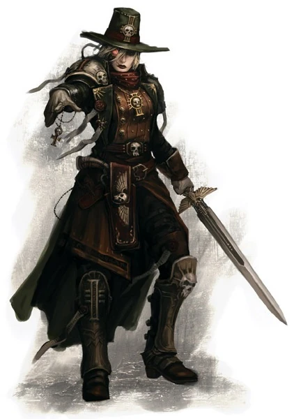

#### Chasseur de sorcière {#witchhunter .newpage}

{height=5cm}

Les chasseurs de sorcières sont généralement regroupés au sein de l’Ordo Hereticus et de l’Ordo Malleus pour traquer respectivement les hérétiques et les démons. Ces inquisiteurs sont souvent des psioniques entraînés, mais ce n’est pas le cas de tous, car certains peuvent considérer le potentiel psionique comme un signe d’hérésie en soi. Les chasseurs de sorcières sont généralement les plus puritains de l’Inquisition sur le plan idéologique, et ils entraînent souvent leur esprit et leur corps pour résister aux pouvoirs des sorciers.

#### Chasseur de sorcière

*Humain (tout monde d'origine) de taille moyenne, tout alignement loyal*

**Classe d'armure** 17 (armure énergétique légère)

**Points de vie** 123 (19d8 + 38)

**Vitesse** 9 m

|FOR    | DEX    | CON    | INT    | SAG    | CHA|
|:---:  | :---:  | :---:  | :---:  | :---:  | :---:|
|17 (+3)| 16 (+3)| 14 (+2)| 15 (+2)| 16 (+3)| 16 (+3)|

**Jet de sauvegarde** : Con +7, Int +7, Sag +6, Cha +6

**Compétences** : Connaissance +6, Investigation +7 Occultisme +7, Perception +7

**Résistance aux dégats** : psychique, force

**Sens** : Vision dans le noir 18 mètres, Perception passive 17

**Langues** : parle le bas-gothique, le chaotique, l'hérétique, et deux langues supplémentaire

**Facteur de puissance** : 7 (2 900 XP)

##### Traits

**Armes améliorées.** Les attaques à l’arme de l’inquisiteur sont améliorées.

**Armes Psychiques.** Les armes de l'inquisiteur provoque 7 (2d6) dégâts psychique supplémentaire lorsqu'il touche avec.

**Résistance psychique.** L’inquisiteur bénéficie d’un avantage aux jets de sauvegarde de Sagesse et de Charisme contre les pouvoirs psychiques.

**Lancement de pouvoirs psychiques.** L’inquisiteur est un lanceur de pouvoirs psychiques de niveau 8. Sa capacité de lancement de pouvoirs psychiques est la Sagesse (jet de sauvegarde contre les sorts : 15, +7 pour toucher). L’inquisiteur dispose de 32 points de pouvoir psychiques et connaît les pouvoirs psychiques suivants :

*À volonté* : Feux follets, écharde mentale (2d6), message

*Niveau 1* : détecter le warp, enhardissent, ordre, Repousser le warp

*Niveau 2* : détecter l'invisibilité, détecter les pensées, zone de vérité

*Niveau 3* : fracturer du warp, lever une malédiction, repousser la sorcière

*Niveau 4* : bannissement, relocalisation, zone divine

##### Actions

**Attaque multiple.** L'inquisiteur effectue trois attaques.

**Grande hache.** Attaque au corps à corps : +7 pour toucher, portée de 1,5 mètre, une cible. Touché : 9 (1d12+3) points de dégâts cinétiques plus 7 (2d6) points de dégâts psioniques.

**Carabine.** Attaque avec une arme à distance : +7 pour toucher, portée 25/100 mètres, une cible. Touché : 7 (1d8+3) points de dégâts cinétiques plus 7 (2d6) points de dégâts psioniques.

