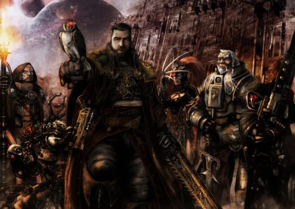

#### Inquisiteur Enquêteur {#enqueteur .newpage}

{height=5cm}

Les enquêteurs, qui constituent sans doute le type d’inquisiteur le plus courant, servent au sein de l’Ordo Xenos ou de l’Ordo Hereticus afin d’éradiquer les ennemis de l’Imperium. Ces inquisiteurs disposent d’une panoplie d’outils et de compétences en matière d’enquête, de déduction sociale et de combat, si le besoin s’en fait sentir.

Ces inquisiteurs proviennent le plus souvent de milieux très divers, avec une légère prédominance de membres issus de l’Adeptus Arbites, car leur travail d’enquêteur au sein des forces de police les a aidés à se préparer à leur service au sein de l’Inquisition.

#### Inquisiteur Enquêteur

*Humain (tout monde d'origine) de taille moyenne, tout alignement loyal*

**Classe d'armure** 16 (armure de fibre)

**Points de vie** 85 (13d8 + 26)

**Vitesse** 9 m

|FOR    | DEX    | CON    | INT    | SAG    | CHA|
|:---:  | :---:  | :---:  | :---:  | :---:  | :---:|
|12 (+1)| 19 (+4)| 14 (+2)| 19 (+4)| 16 (+3)| 17 (+3)|

**Jet de sauvegarde** : Dex +7, Int +7, Sag +6

**Compétences** : Connaissance +6, Discretion +10, Investigation +10 Occultisme +7, Perception +9, Technologie +7, Tromperie +6

**Sens** : Vision dans le noir 18 mètres, Perception passive 19

**Langues** : parle le bas-gothique, et trois langues supplémentaire

**Facteur de puissance** : 7 (2 900 XP)

##### Traits

**Embuscade.** L'inquisiteur bénéficie d'un avantage lors des jets d'attaque contre des créatures prises par surprise.

**Évasion.** Si l'inquisiteur est soumis à un effet lui permettant d'effectuer un jet de sauvegarde pour ne subir que la moitié des dégâts, il ne subit aucun dégât s'il réussit son jet de sauvegarde, et seulement la moitié des dégâts s'il échoue.

**Lancement de pouvoir technologiques.** L’inquisiteur est un lanceur de pouvoir technologiques de niveau 10. Sa capacité de lancement de pouvoir est l’Intelligence (jet de sauvegarde technologique de 15, +7 pour toucher avec les attaques technologiques). L’inquisiteur dispose de 40 points de lanceur de pouvoir technologiques et connaît les pouvoirs technologiques suivants :

*À volonté* : lumière, marche/arrêt, réparation mineur,Touché électrisante (2d8)

*Niveau 1* : contre-mesures, déguisement holographique, détection d’amélioration, nuage de fumée, programme de traduction

*Niveau 2* : champ de camouflage, contrebande, piratage avancé, libération

*Niveau 3* : Lire les données, neutralisation technologique, programme de traduction supérieur

*Niveau 4* : champ de camouflage supérieur, téléporteur de particules

*Niveau 5* : banque de mémoire, tromperie

##### Actions

**Attaque multiple.** L'inquisiteur effectue trois attaques.

**Grande épée.** Attaque au corps à corps : +7 pour toucher, portée de 1,5 mètre, une cible. Touché : 6 (1d6+3) points de dégâts cinétiques. La cible doit réussir un jet de sauvegarde de constitution à DC 15 et subit subit également 24 (7d6) dégâts de poison s'il échoue, la moitié si le test est réussit.

**Carabine.** Attaque avec une arme à distance : +7 pour toucher, portée 25/100 mètres, une cible. Touché : 7 (1d8+3) points de dégâts cinétiques et la cible doit effectuer un jet de sauvegarde de Constitution avec un DC de 15 ; en cas d'échec, elle subit 24 (7d6) points de dégâts de poison, et la moitié de ces dégâts en cas de réussite.

