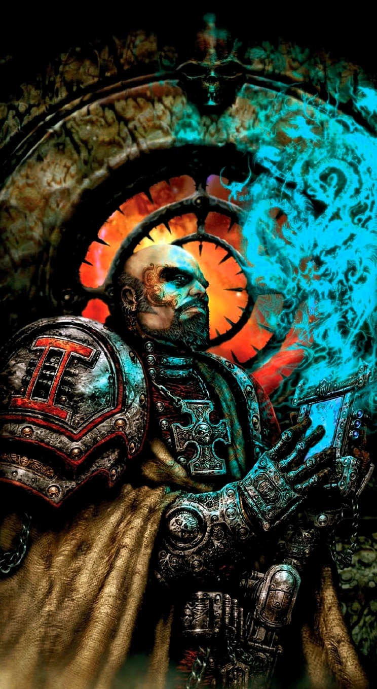

#### Inquisiteur psyker {#inquisiteur-psyker .newpage}

{height=5cm}

Au sein de l’Inquisition, les psykers peuvent être très prisés, au même titre que les inquisiteurs eux-mêmes. Les psykers sont connus pour leur capacité à manipuler l’esprit d’autrui, ainsi qu’à déclencher des effets dévastateurs capables d’éliminer à eux seuls des escouades entières d’hérétiques. Un tel pouvoir est très convoité par les hérétiques, et la présence d’un psionique parmi les inquisiteurs les place sur un pied d’égalité.

Les psykers de l’Inquisition font l’objet de controverses, car la manifestation de capacités psychiques s’accompagne souvent d’un lien inquiétant avec le Warp. C’est pourquoi de nombreux psykers au sein de l’Inquisition sont soumis à des tests de pureté réguliers. Les psykers qui se révèlent après avoir rejoint l’Inquisition suscitent encore plus de controverses, car ils ne sont généralement jamais officiellement reconnus par l’Imperium, et leurs nouveaux pouvoirs peuvent être le résultat de rituels hérétiques et d’une souillure de l’âme.

#### Inquisiteur psyker

*Humain (tout monde d'origine) de taille moyenne, tout alignement loyal*

**Classe d'armure** 16 (armure énergétique légère)

**Points de vie** 71 (13d8 + 13)

**Vitesse** 9 m

|FOR    | DEX    | CON    | INT    | SAG    | CHA|
|:---:  | :---:  | :---:  | :---:  | :---:  | :---:|
|10 (0)| 12 (+1)| 12 (+1)| 14 (+2)| 19 (+4)| 16 (+6)|

**Jet de sauvegarde** : Int +5, Sag +7, Cha +6

**Compétences** : Connaissance +5, Occultisme +7, Perception +7

**Résistance aux dégats** : psychique

**Sens** : Vision dans le noir 18 mètres, Perception passive 16

**Langues** : parle le bas-gothique, le chaotique, les codes impériaux, l'hérétique, le haut-gothique

**Facteur de puissance** : 8 (3 900 XP)

##### Traits

**Psyker de combat.** Lorsque l’inquisiteur utilise son action pour lancer un pouvoir, il peut effectuer une attaque à l’arme en tant qu’action bonus.

**Armes améliorées.** Les attaques à l’arme de l’inquisiteur sont améliorées.

**Résistance psychique.** L’inquisiteur bénéficie d’un avantage aux jets de sauvegarde de Sagesse et de Charisme contre les pouvoirs psychiques.

**Lancement de pouvoirs psychiques.** L’inquisiteur est un lanceur de pouvoirs psychiques de niveau 10. Sa capacité de lancement de pouvoirs psychiques est la Sagesse (jet de sauvegarde contre les sorts : 15, +7 pour toucher). L’inquisiteur dispose de 40 points de pouvoir psychiques et connaît les pouvoirs psychiques suivants :

*À volonté* : châtiment (2d10), invoquer un phénomène, main psychique

*Niveau 1* : détecter le Warp, mains brûlantes, perception des émotions, repousser le Warp

*Niveau 2* : ddétection de l’invisibilité, entrave de personne, fouet mental, invisibilité

*Niveau 3* : boule de feu, fracture le Warp, perturbation du Warp, repousser la sorcière

*Niveau 4* : Zone divine, relocalisation

*Niveau 5* : cône de froid, modifier la mémoire

##### Actions

**Attaque multiple.** L'inquisiteur effectue deux attaques.

**Grande hache de force.** Attaque au corps à corps : +7 pour toucher, portée de 1,5 mètre, une créature. Touché : 10 (1d12+4) points de dégâts cinétiques.

