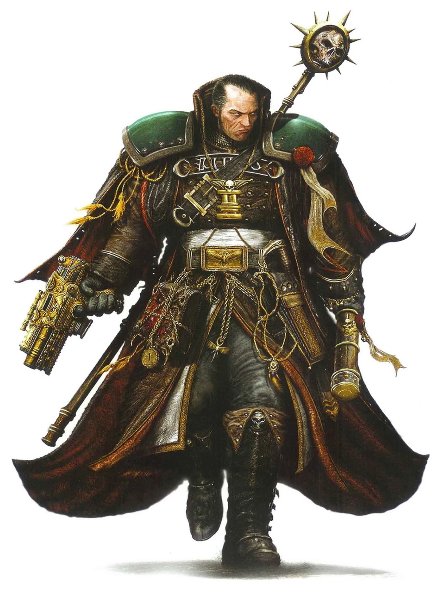

#### Seigneur inquisiteur {#seigneur-inquisiteur .newpage}

{height=5cm}

Le plus haut placé parmi tous les inquisiteurs est le seigneur inquisiteur. Ces inquisiteurs prennent généralement en charge les missions globales et les relations au sein de secteurs entiers du Calixis, aidant et guidant les autres inquisiteurs de ce domaine afin de faire peser le marteau de l’Empereur là où cela s’avère nécessaire.

#### Seigneur inquisiteur

*Humain (tout monde d'origine) de taille moyenne, tout alignement loyal*

**Classe d'armure** 18 (armure énergétique)

**Points de vie** 229 (27d8 + 108)

**Vitesse** 9 m

|FOR    | DEX    | CON    | INT    | SAG    | CHA|
|:---:  | :---:  | :---:  | :---:  | :---:  | :---:|
|20 (+5)| 16 (+3)| 18 (+4)| 14 (+2)| 14 (+2)| 18 (+4)|

**Jet de sauvegarde** : For +9, Dex +7, Con +8

**Compétences** : Athlétisme +9, Intimidation +8, Perception +5, Persuasion +8

**Sens** : Perception passive 15

**Langues** : parle le bas-gothique, le haut-gothique et 2 langues supplémentaires

**Facteur de puissance** : 13 (10 000 XP)

##### Traits

**Armes améliorées.** Les attaques à l'arme de l'inquisiteur sont améliorées.

**Indomptable (3/jour).** L'inquisiteur peut relancer un jet de sauvegarde s'il échoue. Il doit utiliser le nouveau résultat.

**Survivant.** L’inquisiteur regagne 10 points de vie au début de son tour s’il dispose d’au moins 1 point de vie, mais de moins de la moitié de son maximum de points de vie.

**Spécialiste des armes.** Les armes infligent un dé de dégâts supplémentaire lorsque le Space Marine touche avec celle-ci (inclus dans l’attaque).

##### Actions

**Attaque multiple.** L'inquisiteur effectue trois attaques avec son marteau de guerre, ou deux attaques avec son pistolet.

**Marteau de guerre.** Attaque au corps à corps : +9 pour toucher, portée de 1,5 mètre, une cible. Touché : 14 (2d8+5) points de dégâts cinétiques s'il est manié d'une seule main, ou 16 (2d10+5) points de dégâts cinétiques s'il est manié à deux mains.

**Pistolet.** Attaque avec une arme à distance : +7 pour toucher, portée 12/48 mètres, une cible. Touché : 12 (2d8+3) points de dégâts cinétiques.

##### Actions Légendaires

L’inquisiteur peut effectuer 3 actions légendaires, en choisissant parmi les options ci-dessous. Une seule option d’action légendaire peut être utilisée à la fois, et uniquement à la fin du tour d’une autre créature. L’inquisiteur récupère ses actions légendaires utilisées au début de son tour.

**Attaque à l’arme.** L’inquisiteur effectue une attaque à l’arme.

**Commander un allié.** L’inquisiteur choisit comme cible un allié qu’il peut voir et qui se trouve à moins de 9 mètres de lui. Si la cible peut voir et entendre l’inquisiteur, elle peut effectuer une attaque à l’arme en réaction et bénéficie d’un avantage au jet d’attaque.

**Effrayer un ennemi (coûte 2 actions).** L’inquisiteur cible un ennemi qu’il peut voir à moins de 9 mètres de lui. Si la cible peut le voir et l’entendre, elle doit réussir un jet de sauvegarde de Sagesse avec un DD de 16, sinon elle est effrayée jusqu’à la fin du prochain tour de l’inquisiteur.

