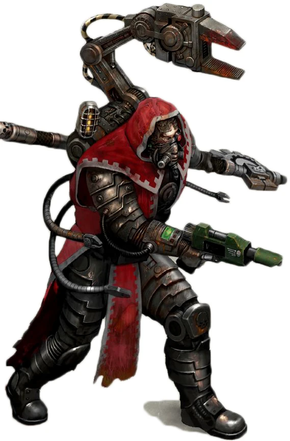

#### Ingénieur {#ingenieur  .newpage}

{height=5cm}

Spécialisés dans la réparation et l’entretien des diverses machines et armes du Mechanicus, les ingénieurs sont les disciples du Dieu-Machine. Ils sont régulièrement affectés à la Marine impériale et aux régiments impériaux pour assurer la maintenance de leurs machines de guerre. Pour le garde lambda, l’ingénieur n’est qu’un tourbillon de chants binaires et de métal, récitant des prières et des bénédictions à l’esprit de la machine de tout objet nécessitant une réparation.

#### Ingénieur

*Humanoïde (Techno-fusionné) de taille moyenne, loyal neutre*

**Classe d'armure** 13 (armure naturelle)

**Points de vie** 55 (4d8 + 4)

**Vitesse** 9 m,

FOR    | DEX    | CON    | INT    | SAG    | CHA
:---:  | :---:  | :---:  | :---:  | :---:  | :---:
10 (+0)| 14 (+2)| 12 (+1)| 15 (+2)| 12 (+1)| 11 (0)

**Compétences** : Technologie +4

**Sens** : Perception passive 10

**Résistance aux dégats** : poison

**Langues** : parle le bas-gothique et le binaire

**Facteur de puissance** : 1 (200 XP)

##### Traits

**Résilience artificielle.** L'ingénieur bénéficie d’un avantage aux jets de sauvegarde contre l’empoisonnement et est immunisé contre les maladies non améliorier. L'ingénieur ne peut pas être endormi.

**Mécadendrite.** L'ingénieur dispose d’une mécadendrite qui fonctionne exactement comme un bras supplémentaire. Il bénéficie d’un avantage aux jets de sauvegarde de Force contre les effets qu’il peut voir, ainsi qu’aux tests de Force (Athlétisme) pour résister à une prise.

**Lanceur de pouvoir technologique.** L'ingénieur est un lanceur de pouvoir technologique de niveau 3 (jet de sauvegarde technologique de 12, +4 pour toucher avec les attaques techniques). Il dispose de 12 points de lanceur de pouvoir technologique et maîtrise les pouvoirs technologique suivants :

À volonté : décharge de plasma, marche/arrêt, réparation
Niveau 1 : copie, réparation, tranquillisant
Niveau 2 : Métal brûlant, tir de plasma

##### Actions

**Clé.** Attaque au corps à corps : +2 pour toucher, portée de 5 pieds, une cible. Touché : 2 (1d4) points de dégâts cinétiques.

**Pistolet laser.** Attaque à distance : +3 pour toucher, portée de 40/160 pieds, une cible. Touché : 3 (1d4+1) points de dégâts énergétiques.

