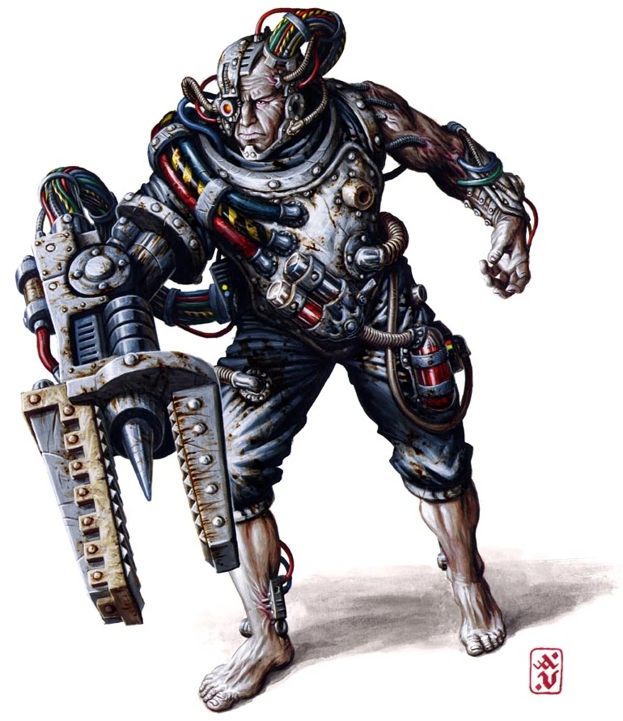

#### Servitor Industriel  {#ServitorIndustriel  .newpage}

{height=5cm}

Ces Serviteurs ont été équipés de dispositifs leur permettant de soulever des charges, de forer la roche ou de broyer du minerai dans l'un des innombrables complexes industriels de l'Imperium, ou bien ils sont dotés d'équipements de réparation spécialisés et chargés de l'entretien de tout ou partie d'un complexe industriel.

#### Servitor de combat

*Construct de taille moyenne, sans alignement*

**Classe d'armure** 14 (armure naturel)

**Points de vie** 7 (1d8 + 2)

**Vitesse** 9 m

FOR    | DEX    | CON    | INT    | SAG    | CHA
:---:  | :---:  | :---:  | :---:  | :---:  | :---:
15 (+2)| 8 (-1)| 14 (+2)| 4 (-3)| 3 (-2)| 3 (-4)

**Compétences** : Athlétisme +4

**Sens** : Perception passive 8

**Résistance aux dégats** : poison

**Langues** : comprend le binaire et le bas-gothique mais ne les parles pas

**Facteur de puissance** : 1/2 (100 XP)

##### Traits

**Constitution robuste.** Le serviteur est considéré comme étant d’une taille supérieure lors du calcul de sa capacité de charge et du poids qu’il peut pousser, traîner ou soulever.

##### Actions

**Coup violent.** Attaque au corps à corps avec une arme : +4 pour toucher, portée de 1,5 mètre, une cible. Touché : 6 (1d8+2) points de dégâts cinétiques.

