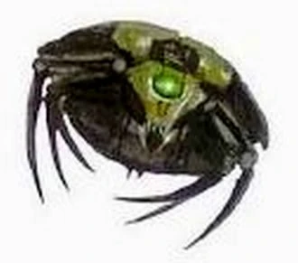

#### Essaim de Scarabées Canoptek {#essaim-scarabees .newpage}

{height=5cm}

#### Guerrier Nécron

*Construct de taille minuscule*

**Classe d'armure** 13 (armure naturelle)

**Points de vie** 24 (7d8 - 7)

**Vitesse** 3m, vol 15 (stationnaire)

|FOR    | DEX    | CON    | INT    | SAG    | CHA|
|:---:  | :---:  | :---:  | :---:  | :---:  | :---:|
|6 (-2)| 14 (+2)| 8 (-1)| 5 (-3)| 12 (+1)| 6 (-2)|

**Résistance aux dégâts** : Energie et cinétique

**Immunité aux dégâts** : poison

**Immunité aux états** : Agrippé, assommé, à terre, Charmé, Entravé, effrayé, empoisonné, fatigué, paralysé, pétrifié

**Compétence** : Perception +3

**Sens** : Perception passive 13

**Langues** : comprend le Necrontyr mais ne le parle pas

**Facteur de puissance** : 1/4 (50 XP)

##### Traits

**Essaim.** L’essaim peut occuper l’espace d’une autre créature et inversement, et il peut se faufiler à travers toute ouverture suffisamment large pour laisser passer un scarabée minuscule. L’essaim ne peut ni regagner de points de vie ni obtenir de points de vie temporaires.

##### Actions

**Mandibules.** Attaque à l’arme de mêlée : +4 pour toucher, portée contact, une cible. Touché : 7 (2d6) points de dégâts cinétiques ou 3 (1d6) points de dégâts cinétiques si l’essaim a la moitié de ses points de vie ou moins.

