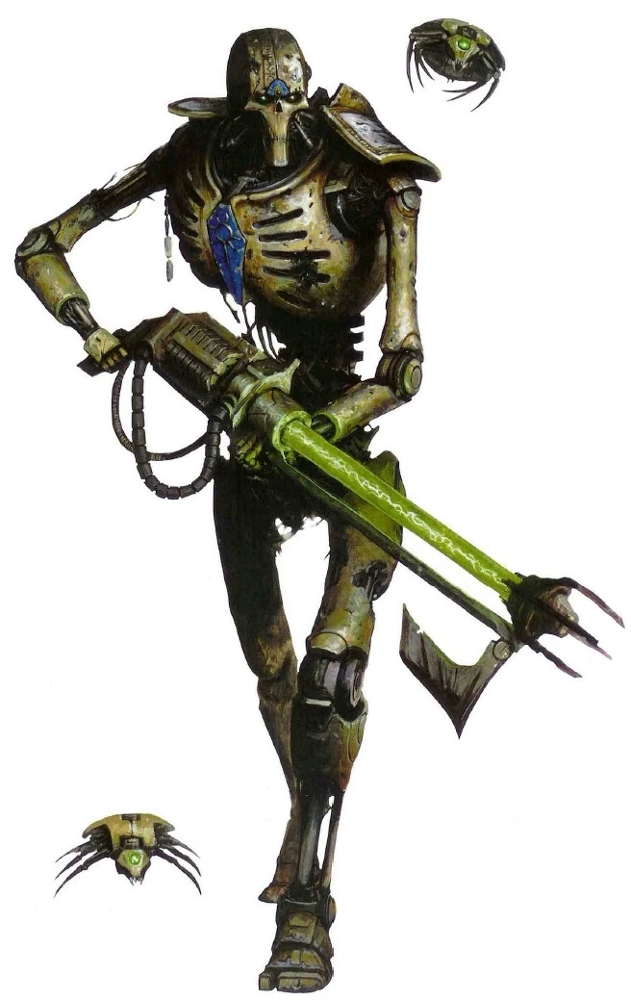

#### Guerrier Nécron {#guerrierNecron .newpage}

{height=5cm}

#### Guerrier Nécron

*Construct de taille moyenne, loyal mauvais*

**Classe d'armure** 17 (armure naturelle)

**Points de vie** 59 (7d8 + 27)

**Vitesse** 9 m

|FOR    | DEX    | CON    | INT    | SAG    | CHA|
|:---:  | :---:  | :---:  | :---:  | :---:  | :---:|
|15 (+2)| 14 (+2)| 16 (+3)| 5 (-3)| 10 (0)| 6 (-2)|

**Résistance aux dégâts** : Psychique, nécrotique ; aux dégâts d’énergie et cinétiques infligés par des attaques non améliorées.

**Immunité aux dégâts** : poison

**Immunité aux états** : Charmé, effrayé, empoisonné, fatigué, paralysé, pétrifié

**Sens** : Vision dans le noir 18 mètres, Perception passive 13

**Langues** : comprend le Necrontyr mais ne le parle pas

**Facteur de puissance** : 4 (1 100 XP)

##### Traits

**Armes améliorées.** Les attaques au corps à corps du Nécron sont améliorées.

**Régénération.** Le Nécron regagne 10 points de vie au début de son tour. Si le Nécron subit des dégâts d’acide ou de feu, cette capacité ne s’applique pas au début de son tour suivant. Le Nécron ne meurt que s’il commence son tour avec 0 point de vie et ne se régénère pas.

##### Actions

**Attaque multiple.** Le Nécron effectue deux attaques.

**Fusil Gauss.** Attaque au corps à corps : +4 pour toucher, portée 30/120 mètres, une cible. Touché : 8 (1d10+3) points de dégâts d'énergie.

**Coup violent.** Attaque au corps à corps : +4 pour toucher, portée de 1,5 mètre, une cible. Touché : 8 (1d10+3) points de dégâts cinétiques.

