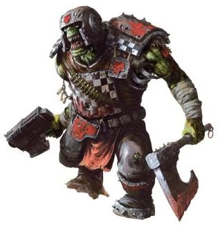

#### Ork Boy {#OrkBoy .newpage}

{height=5cm}

Le plus nombreux parmi les hordes d'Orks sont les Boyz. Ce sont des Orks tout à fait classiques, équipés d'un attirail de fortune et qui collectionnent les dents des autres Orks. Chaque Ork commence sa vie en tant que Boy, qu'il le veuille ou non.

#### Ork Boy

*humanoïde (ork) de taille moyenne, chaotique neutre*

**Classe d'armure** 13 (armure pare-éclats)

**Points de vie** 15 (2d8 + 6)

**Vitesse** 9 m

|FOR    | DEX    | CON    | INT    | SAG    | CHA|
|:---:  | :---:  | :---:  | :---:  | :---:  | :---:|
|16 (+3)| 10 (0)| 16 (+3)| 7 (-2)| 11 (0)| 10 (0)|

**Compétences** : Intimidation +2

**Sens** : Perception passive 10

**Langues** : Ork et le bas-gothique

**Facteur de puissance** : 1/2 (100 XP)

##### Traits

**WAAAGH !** En tant qu’action bonus, l’ork peut se déplacer jusqu’à sa vitesse vers une créature hostile qu’il peut voir.

##### Actions

**Hache d'arme.** Attaque au corps à corps : +5 pour toucher, portée de 1,5 mètre, une cible. Touché : 9 (1d12+3) points de dégâts cinétiques.

**Javelot.** Attaque avec une arme de mêlée ou à distance : +5 pour toucher, portée de 1,5 mètre ou portée de 9/36 mètres, une cible. Touché : 6 (1d6+3) points de dégâts cinétiques.

**Shoota (carabine).** Attaque à distance : +2 pour toucher, portée de 24/90 pieds, une cible. Touché : 4 (1d8) points de dégâts cinétiques.

