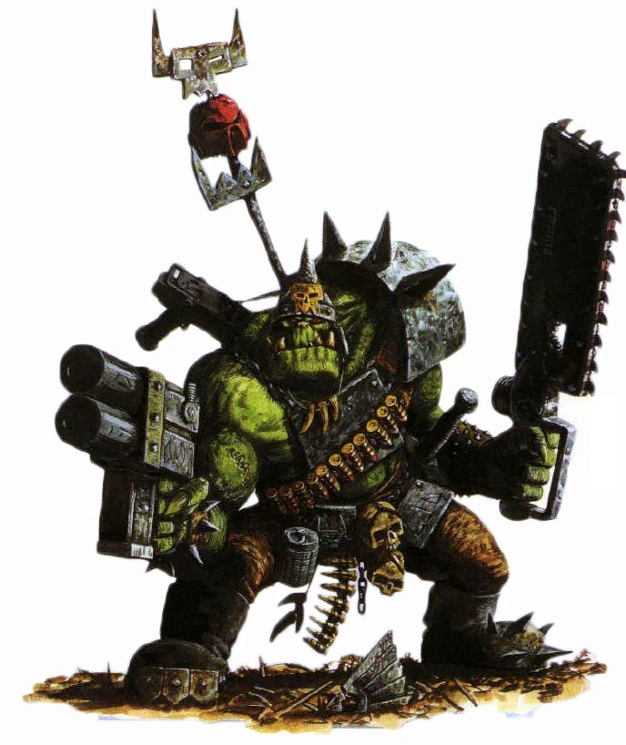

#### Ork Nob {#OrkNob .newpage}

{height=5cm}

Au sein d'un groupe de Boyz, il arrive qu'un seul d'entre eux devienne un Nob. Ces Nobz sont légèrement plus grands que les Orks ordinaires et font office de chefs de file au sein de petites bandes d'Orkss.

#### Ork Nob

*humanoïde (ork) de taille moyenne, chaotique neutre*

**Classe d'armure** 17 (armure d'assault)

**Points de vie** 51 (6d8 + 20)

**Vitesse** 9 m

|FOR    | DEX    | CON    | INT    | SAG    | CHA|
|:---:  | :---:  | :---:  | :---:  | :---:  | :---:|
|18 (+4)| 12 (+1)| 18 (+4)| 9 (-1)| 11 (0)| 12 (+1)|

**Compétences** : Intimidation +5, Survie +2

**Sens** : Perception passive 10

**Langues** : Ork et le bas-gothique

**Facteur de puissance** : 2 (450 XP)

##### Traits

**WAAAGH !** En tant qu’action bonus, l’ork peut se déplacer jusqu’à sa vitesse vers une créature hostile qu’il peut voir.

##### Actions

**Attaque multiple.** L'ork effectue deux attaques à la hache d'arme.

**Hache d'arme.** Attaque au corps à corps : +6 pour toucher, portée de 1,5 mètre, une cible. Touché : 10 (1d12+4) points de dégâts cinétiques.

**Javelot.** Attaque avec une arme de mêlée ou à distance : +5 pour toucher, portée de 1,5 mètre ou portée de 9/36 mètres, une cible. Touché : 7 (1d6+4) points de dégâts cinétiques.

**Shoota (carabine).** Attaque à distance : +3 pour toucher, portée de 24/90 pieds, une cible. Touché : 5 (1d8+1) points de dégâts cinétiques.

