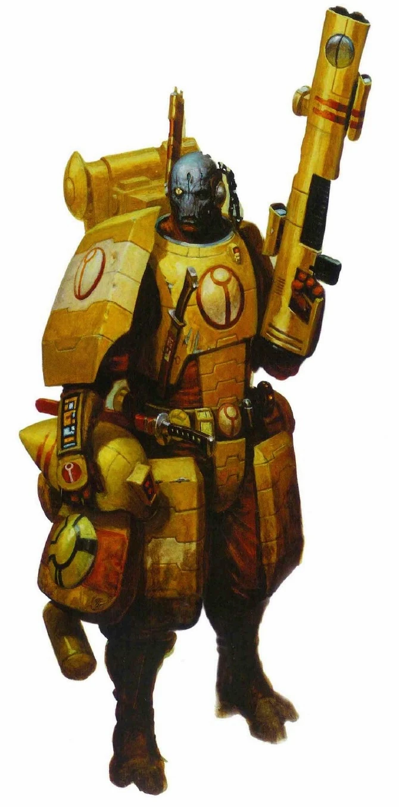

#### Guerrier de la Caste du feu {#firewarrior .newpage}

{height=5cm}

#### Guerrier de la Caste du feu

*humanoïde (T'au) de taille moyenne, loyal bon*

**Classe d'armure** 16 (armure composite)

**Points de vie** 16 (3d8 + 3)

**Vitesse** 9 m

|FOR    | DEX    | CON    | INT    | SAG    | CHA|
|:---:  | :---:  | :---:  | :---:  | :---:  | :---:|
|11 (+1)| 14 (+2)| 12 (+1)| 12 (+1)| 11 (+1)| 10 (0)|

**Compétences** : Perception +2

**Sens** : Perception passive 12

**Langues** : T'au

**Facteur de puissance** : 1 (200 XP)

##### Actions

**Épée courte.** Attaque au corps à corps : +4 pour toucher, portée 1,5 mètre ; Touché : 5 (1d6+2) points de dégâts cinétiques.

**Fusil à impulsions.** Attaque à distance : +4 pour toucher, portée 45/180 pieds, une cible ; Touché : 9 (2d6+2) points de dégâts énergétiques.

