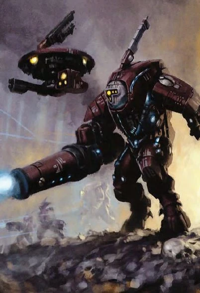

#### Armure de combat XV25 "Stealth" {#stealth .newpage}

{height=5cm}

####  Armure de combat XV25 "Stealth"

*humanoïde (Tau) de taille moyenne, Loyal bon*

**Classe d'armure** 16 (armure composite)

**Points de vie** 33 (6d8 + 6)

**Vitesse** 9 m

|FOR    | DEX    | CON    | INT    | SAG    | CHA|
|:---:  | :---:  | :---:  | :---:  | :---:  | :---:|
|11 (0)| 15 (+2)| 12 (+1)| 14 (+2)| 12 (+1)| 11 (0)|

**Compétences** : Discretion +6, Perception +3

**Sens** : Perception passive 13

**Langues** : Tau

**Facteur de puissance** : 3 (700 XP)

##### Traits

**Lancement de pouvoir technologiques inné.** La capacité innée de lancement de pouvoir technologiques du soldat est liée à son Intelligence (jet de sauvegarde technologique de DC 12, +4 pour toucher avec les attaques technologiques). Le soldat peut lancer de manière innée les pouvoirs suivants :

- 3 fois par jour chacun : champ de camouflage (niv2 sur lui-même uniquement), communication longue portée (niv 3)

- 1 fois par jour chacun : champ de camouflage supérieur (niv 4 sur lui-même uniquement), invisibilité aux caméras (niv 3)

**Camouflage rapide.** Le soldat peut utiliser une action bonus pour se cacher lorsqu’il est invisible.

##### Actions

**Attaque multiple.** Le soldat effectue deux attaques avec sa carabine à impulsion.

**Dague.** Attaque au corps à corps : +4 pour toucher, portée 1,5 mètre ; Touché : 4 (1d4+2) points de dégâts cinétiques.

**Carabine à impulsions.** Attaque à distance : +4 pour toucher, portée 45/180 pieds, une cible ; Touché : 9 (2d6+2) points de dégâts énergétiques.

