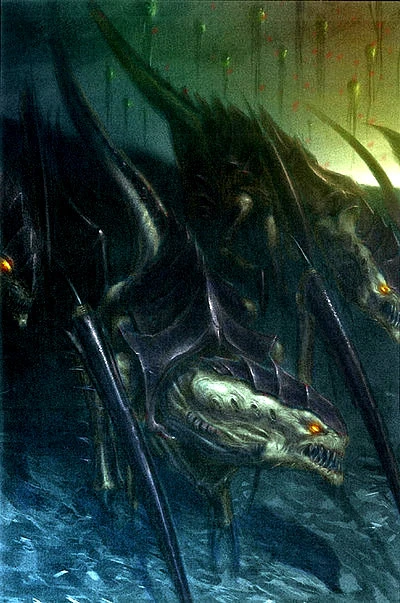

#### Hormagaunt {#hrmagaunt .newpage}

{height=5cm}

**Biomorphes alternatifs**

Les hormagaunts sont agressifs et rapides ; ils font souvent l’objet de biomorphes visant à leur permettre d’atteindre plus rapidement la ligne de front ou de résister à davantage de tirs avant d’être mis hors de combat. Vous trouverez ci-dessous une liste des biomorphes potentiels dont peut disposer un hormagaunt. Gardez à l’esprit que cela peut modifier l’indice de difficulté du monstre.

*Sacs toxiques.* Ces sacs permettent à l’hormagaunt d’enrober ses faux de puissantes toxines. Cela ajoute 2 (1d4) points de dégâts de poison aux attaques effectuées avec ses serres en forme de faux.

*Glandes surrénales.* Les glandes surrénales permettent au tyranide de bénéficier de brèves accélérations. Cela augmente la vitesse de déplacement de l’hormagaunt de 10.

*Carapace renforcée.* Une carapace plus résistante permet au tyranide de survivre plus longtemps au combat. Cela augmente la classe d’armure de l’hormagaunt de 1.

#### Hormagaunt

*Montre de petite taille, sans alignement*

**Classe d'armure** 15 (armure naturelle)

**Points de vie** 9 (2d6+2)

**Vitesse** 9 m

|FOR    | DEX    | CON    | INT    | SAG    | CHA|
|:---:  | :---:  | :---:  | :---:  | :---:  | :---:|
|13 (+1)| 11 (0)| 12 (+1)| 5 (-3)| 12 (+2) | 6 (-2)|

**Compétences** : Perception +3

**Sens** : Perception passive 13

**Langues** : Télépathie 18 mètres (tyranides seulement)

**Facteur de puissance** : 1/4 (50 XP)

##### Traits

**Tactiques de meute.** L’hormagaunt bénéficie d’un avantage lors d’un jet d’attaque contre une créature si au moins un de ses alliés se trouve à moins de 1,5 mètre de cette créature et que cet allié n’est pas hors de combat.

**Physiologie tyranide.** Le termagant bénéficie d’un avantage aux jets de sauvegarde contre les effets de charme, d’effroi, d’empoisonnement ou d’endormissement.

##### Actions

**Griffes tranchantes.** Attaque à l’arme de mêlée : +3 pour toucher, portée de 1,5 mètre, une cible. Touché : 5 (1d6+2) points de dégâts cinétiques.

