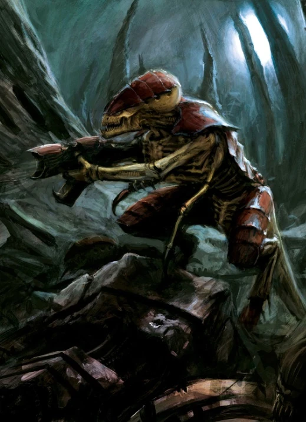

#### Termagant {#termagant .newpage}

{height=5cm}

**Biomorphes alternatifs**

Les Tyranides peuvent évoluer et être créés pour répondre à un besoin spécifique, en fonction des exigences de la flotte-ruche qu’ils servent. Vous trouverez ci-dessous une liste des biomorphes potentiels dont peut disposer un Termagant. Gardez à l’esprit que cela peut modifier le niveau de difficulté du monstre.

*Toile étranglante.* Attaque à distance. +3 pour toucher, portée 10/30 pieds, une cible. Touché : la vitesse de déplacement de la cible est réduite à 0 jusqu'à la fin de son prochain tour.

*Foret de chair.* Attaque à distance : +3 pour toucher, portée 20/60 pieds, une cible. Touché : 6 (2d4+1) points de dégâts cinétiques.

#### Termagant

*Montre de petite taille, sans alignement*

**Classe d'armure** 13 (armure naturelle)

**Points de vie** 7 (2d6)

**Vitesse** 9 m

|FOR    | DEX    | CON    | INT    | SAG    | CHA|
|:---:  | :---:  | :---:  | :---:  | :---:  | :---:|
|10 (0)| 14 (+2)| 11 (0)| 5 (-3)| 13 (+2)| 7 (-2)|

**Compétences** : Perception +3

**Sens** : Perception passive 13

**Langues** : Télépathie 18 mètres (tyranides seulement)

**Facteur de puissance** : 1/4 (50 XP)

##### Traits

**Physiologie des Tyranides.** Le termagant bénéficie d’un avantage aux jets de sauvegarde contre les effets de charme, d’effroi, d’empoisonnement ou d’endormissement.

##### Actions

**Morsure.** Attaque à l’arme de mêlée : +2 pour toucher, portée de 1,5 mètre, une cible. Touché : 2 (1d4) points de dégâts cinétiques.

**Fusil à pointes.** Attaque avec une arme à distance : +4 pour toucher, portée 25/100 mètres, une cible. Touché : 5 (1d6+2) points de dégâts cinétiques.

